

# Poisson Image Editing
Questo progetto si è concentrato sull'implementazione di due tecniche di seamless compositing, ovvero approcci che permettono di eseguire compositing di immagini senza creare artefatti visibili derivanti dai bordi. Di seguito viene introdotto il framework matematico sul quale si basano questi metodi e successivamente vengono riportati dettagli implementativi e risultati ottenuti.

## Interpolazione guidata

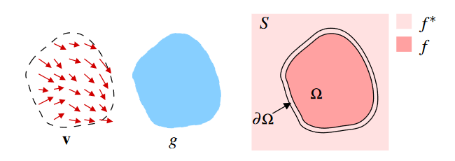{width="70%"}

Sia 
- $S \subset \mathbb{R}^2$ il dominio su cui sono definite le immagini
- $\Omega$ un sottoinsieme chiuso di $S$ con bordo $\partial \Omega$
- $f^*$ una funzione scalare nota definita su $S$ meno l'interno di $\Omega$
- $f$ una funzione scalare incognita definita sull'interno di $\Omega$
- $\mathbf{v}$ un campo vettoriale (*guidance*) definito su $\Omega$

L'immagine composita si ottiene risolvendo il seguente problema di minimizzazione (in modo indipendente per ogni canale colore):

$$
\begin{equation}
\min _f \iint_{\Omega}|\nabla f-\mathbf{v}|^2 \text { with }\left.f\right|_{\partial \Omega}=\left.f^*\right|_{\partial \Omega} 
\end{equation}
$$

La cui soluzione è l'unica soluzione della seguente equazione di Poisson con condizioni al contorno di Dirichlet:

$$
\begin{equation}
\Delta f=\operatorname{div}\mathbf{v}\text{ over }\Omega \text{, with }\left.f\right|_{\partial \Omega}=\left.f^*\right|_{\partial \Omega}
\end{equation}
$$

## Seamless Cloning
### Importing gradients
In questo approccio si sceglie come guidance il gradiente dell'immagine sorgente $g$

$$
\begin{equation}
\mathbf{v} = \nabla g
\end{equation}
$$

quindi $(2)$ diventa

$$
\begin{equation}
\Delta f=\Delta g \text { over } \Omega, \text { with }\left.f\right|_{\partial \Omega}=\left.f^*\right|_{\partial \Omega}
\end{equation}
$$

Questo metodo garantisce che i bordi dell'immagine sorgente e dell'immagine destinazione siano conformi. In molti casi permette di inserire nuovi elementi in un'immagine senza creare transizioni visibili e innaturali tra le due regioni.

### Mixing gradients

Nell'approccio precedente, all'interno di $\Omega$ perdiamo ogni contributo dato dall'immagine target $f^*$. In alcuni casi però vogliamo combinare le variazioni dell'immagine target $f^*$ con le variazioni dell'immagine sorgente $g$, ad esempio quando dobbiamo inserire oggetti trasparenti.

Definiamo quindi il campo guidance nel seguente modo:
$$
\begin{equation}
\text { for all } \mathbf{x} \in \Omega, \mathbf{v}(\mathbf{x})= \begin{cases}\nabla f^*(\mathbf{x}) & \text { if }\left|\nabla f^*(\mathbf{x})\right|>|\nabla g(\mathbf{x})|, \\ \nabla g(\mathbf{x}) & \text { otherwise. }\end{cases}
\end{equation}
$$

## Discretizzazione
- $S$ e $\Omega$ diventano insiemi finiti di punti su una griglia discreta
- per ogni pixel $p$ in $S$, definiamo $N_p$ come l'insieme dei suoi neighbors 4-connected che appartengono a $S$
- sia $\langle p, q \rangle$ una coppia di pixel tale che $q \in N_p$
- sia $\partial \Omega=\left\{p \in S \setminus \Omega: N_p \cap \Omega \neq \emptyset\right\}$ 
- sia $f_p$ il valore di $f$ in $p$

L'obiettivo è quello di calcolare l'insieme delle intensità$\left.f\right|_{\Omega}=\left\{f_p, p \in \Omega\right\}$.

È possibile discretizzare $(1)$ con il metodo delle differenze finite, ottenendo un problema di ottimizzazione discreta la cui soluzione soddisfa il seguente sistema di equazioni lineari

$$
\begin{equation}
\text { for all } p \in \Omega, \quad\left|N_p\right| f_p-\sum_{q \in N_p \cap \Omega} f_q=\sum_{q \in N_p \cap \partial \Omega} f_q^*+\sum_{q \in N_p} v_{p q}
\end{equation}
$$

Nel caso "Importing Gradients"

$$ 
\begin{equation}
v_{pq} = g_p - g_q 
\end{equation}
$$

Mentre nel caso "Mixing Gradients"

$$
\begin{equation}
v_{p q}= \begin{cases}f_p^*-f_q^* & \text { if }\left|f_p^*-f_q^*\right|>\left|g_p-g_q\right|, \\ g_p-g_q & \text { otherwise }\end{cases}
\end{equation}
$$

## Implementazione (`pie.py`, `poisson_compositing.ipynb`)

Data l'immagine source `src`, una maschera booleana `mask` e l'immagine target `tgt`, espresse in "matrix convention" (origine in alto a sinistra, `r` indice di riga, `c` indice di colonna), la prima operazione necessaria è la conversione di `src` e `tgt` dal formato HWC (height, width, channels) al formato CHW (channels, height, width).

Successivamente viene eseguito un cropping (`pie.crop_target`) della porzione dell'immagine `tgt` sulla quale vogliamo applicare il compositing, eventualmente specificando un offset se il cropping deve partire da un punto che non coincide con l'origine di `tgt`. 

A questo punto il metodo `pie.poisson` risolve il sistema di equazioni lineari $(6)$, che in una notazione più compatta si può scrivere come $\mathbf{Ax}=\mathbf{b}$.

In particolare, `x` é l'insieme delle intensità $f_p$ che vogliamo calcolare all'interno di $\Omega$ (`region` nel codice), `A` é la laplacian matrix opportunamente modificata, mentre il contenuto di `b` dipende dall'approccio utilizzato.

Sia `ninside` il numero di elementi `True` di `region` ($\text{ninside} := |\Omega|$)
- `A.shape == (ninside, ninside)`
- `x.shape == (ninside,)`
- `b.shape == (ninside,)`
dove `A` è lo stesso per tutti i canali, mentre abbiamo un `x` e un `b` diverso per ogni canale.

E' quindi necessario introdurre la [laplacian matrix](https://en.wikipedia.org/wiki/Discrete_Poisson_equation#On_a_two-dimensional_rectangular_grid) e capire come modificarla in modo opportuno.

|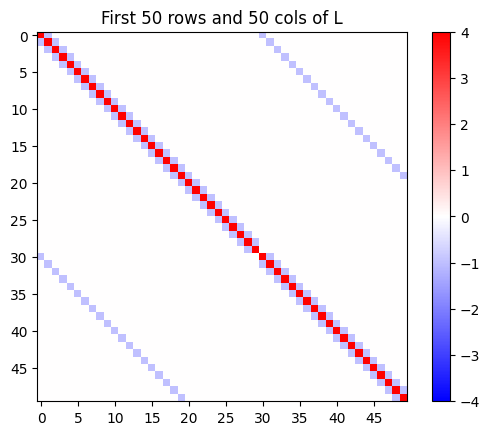{width="30%"}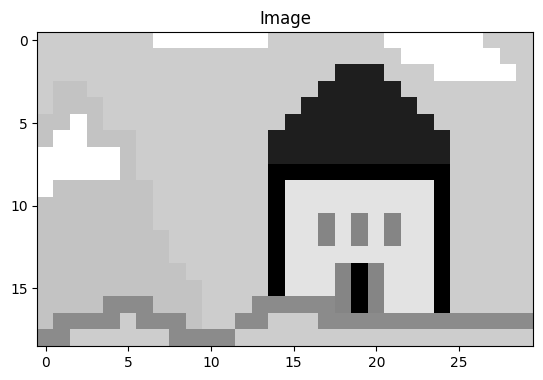{width="26%"}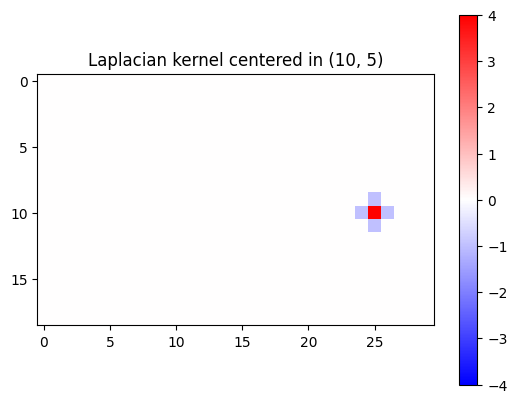{width="30%"}|
|-|
|Data un'immagine `im` con shape `(nrows, ncols)`, la matrice `L`, tale per cui `L.dot(im.reshape(nrows*ncols)).reshape(nrows, ncols)` sia il laplaciano di `im`, ha shape `(nrows*ncols, nrows*ncols)` ed ha una struttura sparsa. Effettuando il reshape `L_ = L.reshape(nrows, ncols, nrows, ncols)`, si nota che `L_[r, c, :, :]` ha la stessa shape di `im` e corrisponde al kernel laplaciano centrato nella posizione `(r, c)`. |

|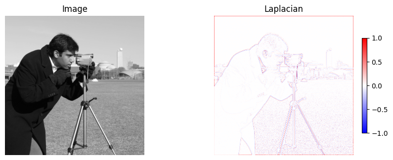{width="80%"}|
|-|
|Si noti che l'operazione `L.dot(im.reshape(nrows*ncols)).reshape(nrows, ncols)` é equivalente a una 2D Cross Correlation di `im` con `ker`, dove `ker` è il kernel laplaciano 3x3 `[[0, -1, 0], [-1, 4, -1], [0, -1, 0]]`. Codice nella sezione "Laplacian" del notebook `poisson_compositing.ipynb`.|

Per costruire la matrice `A` è necessario filtrare la laplacian matrix completa (sfruttando il boolean array indexing di numpy):
- si vogliono tenere solo le righe corrispondenti a situazioni in cui il laplacian kernel è centrato in posizioni `(r, c)` appartenenti a $\Omega$ (se `region[r, c] == True`, allora tengo la riga `r*ncols + c` della laplacian matrix)
- per ognuna di queste righe, teniamo solo i coefficienti che vanno a moltiplicare pixel appartenenti a $\Omega$.

Nell'approccio "Importing Gradients", `b` viene calcolato come il laplaciano dell'immagine `src` $(4)$. In questo caso la matrice laplaciana viene filtrata sulle righe, ma non sulle colonne.

Invece nell'approccio "Mixing Gradients", è necessario prima calcolare i gradienti di `src` e `dest` lungo $x$ e lungo $y$  (metodo `pie.diff`), per ogni posizione `(r, c)` si sceglie come guidance il gradiente di `src` o di `tgt` in base a quale ha magnitude maggiore. `b` viene quindi calcolato come divergenza della guidance $(2)$.

$\partial \Omega$ è stato calcolato come `logical_xor(region, binary_erosion(region))`.

In entrambi gli approcci, per i pixel appartenenti a $\partial \Omega$ è necessario aggiungere nella posizione corrispondente di `b` il termine $\sum_{q \in N_p \cap \partial \Omega} f_q^*$.

Questo termine è stato calcolato per tutte le posizioni facendo una 2D cross-correlation tra l'immagine `tgt` azzerata nelle posizioni appartenenti a `region` e il kernel `[[0, 1, 0], [1, 0, 1], [0, 1, 0]]`, e successivamente sono stati selezionati solo i valori delle posizioni appartenenti a $\partial \Omega$.

E' ora possibile risolvere il sistema $\mathbf{Ax}=\mathbf{b}$ con uno sparse solver (dato che la matrice $A$ è sparsa) in modo indipendente per ogni canale colore.

Il risultato viene infine inserito nell'immagine `tgt` nell'area che era stata individuata con `pie.crop_target`.

## Risultati
|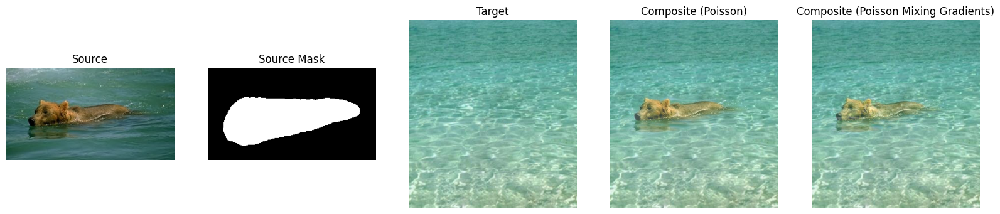 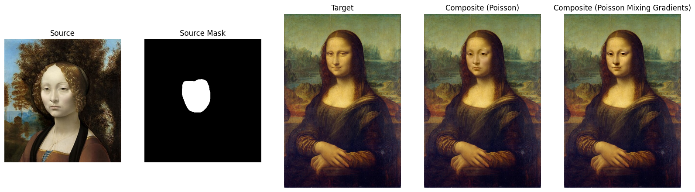|
|-|
|**Inserimento di nuovi oggetti**. Entrambi i metodi producono risultati soddisfacenti. Nel primo caso utilizzare la tecnica "Importing Gradients" permette di ottenere colori più fedeli all'immagine sorgente e causa meno effetti di trasparenza. Nel secondo caso il metodo "Mixing Gradients" permette di trasferire la texture del target nell'immagine composita, lascia però intravedere i lineamenti del viso presente nell'immagine target.|

|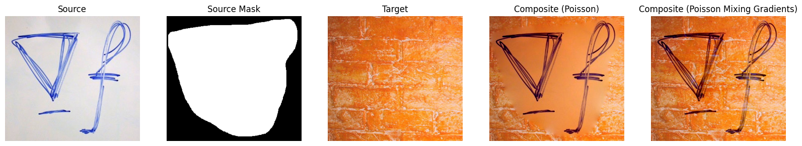|
|-|
|**Inserimento di oggetti con fori.** In questo caso il metodo "Importing Gradients" non è sufficiente, poiché anche le variazioni dell'immagine target sono necessarie per ottenere il compositing corretto. Il metodo "Mixing Gradients" produce invece un risultato realistico.|

|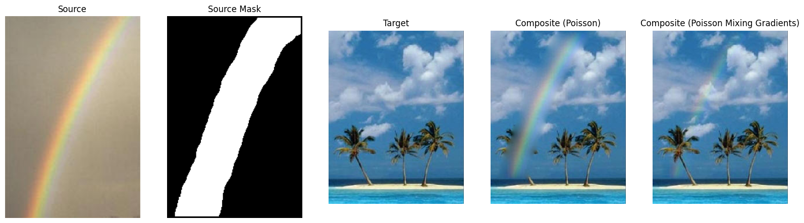|
|-|
|**Inserimento di oggetti trasparenti.** Anche in questo caso il metodo "Mixing Gradients" produce i risultati migliori grazie al modo in cui è stato definito il suo guidance field, che permette di mantenere dettagli dell'immagine target sottostante.|

|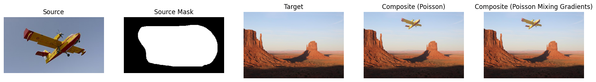  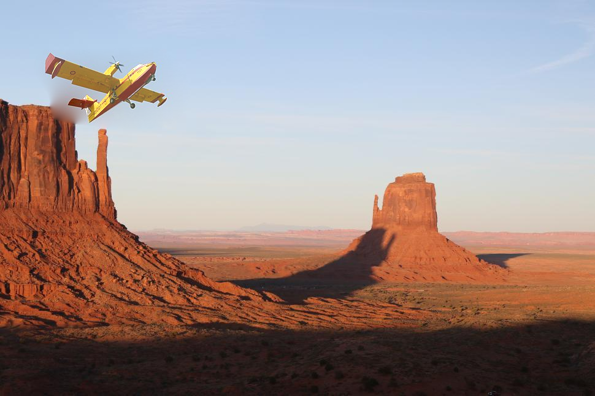{width="40%"} 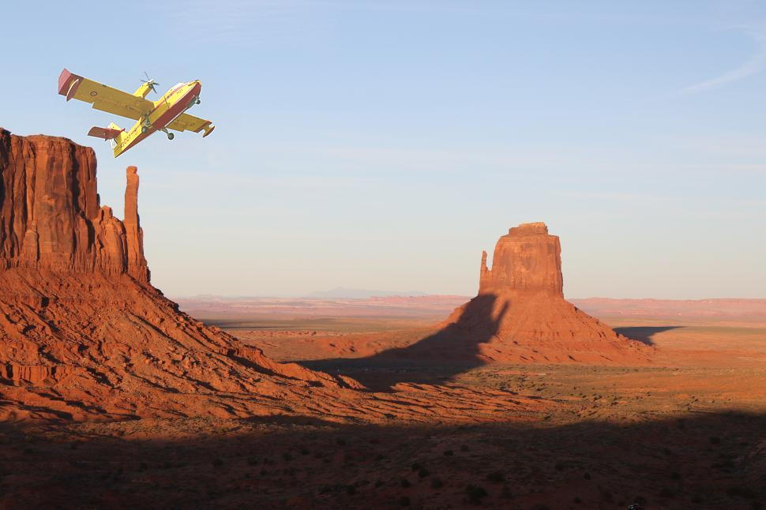{width="40%"}|
|-|
|**Inserimento di un oggetto vicino ad un altro.** Se l'area di destinazione non contiene altri oggetti (figure in alto), entrambi i metodi producono risultati ottimali. Se invece nell'area di destinazione è presente un altro oggetto che interseca i bordi o in generale sono presente forti discontinuità lungo i bordi, l'approccio "Importing gradients" (in basso a sinistra) produce artefatti di bleeding, mentre l'approccio "Mixing gradients" (in basso a destra) produce un risultato ottimale. |

I dati utilizzati per questi test sono disponibili nella cartella `img/`. Il notebook `poisson_compositing.ipynb` permette di replicare questi risultati. I risultati sono presenti nella cartella `results/`.

## Riferimenti
- Poisson Image Editing, Pérez et al
    https://www.cs.jhu.edu/~misha/ReadingSeminar/Papers/Perez03.pdf
- Wikipedia article on Laplacian matrix
    https://en.wikipedia.org/wiki/Discrete_Poisson_equation#On_a_two-dimensional_rectangular_grid
- Code
    - ECSE-4540  Intro to Digital Image Processing, Rich Radke, Lecture 22: Image blending 
        https://www.youtube.com/watch?v=UcTJDamstdk (codice MATLAB mostrato nel video, non disponibile come repository)
    - PPPW/poisson-image-editing
        https://github.com/PPPW/poisson-image-editing/blob/master/poisson_image_editing.ipynb
    - scikit-image
        https://scikit-image.org/
    - numpy
        https://numpy.org/
    - scipy
        https://scipy.org/

