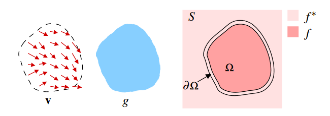

# Poisson Image Editing
This project focused on implementing two seamless compositing techniques, which are approaches that allow image compositing without creating visible artifacts from the borders. Below, we introduce the mathematical framework on which these methods are based, followed by implementation details and obtained results.

## Guided Interpolation

{width="70%"}

Let 
- $S \subset \mathbb{R}^2$ be the domain on which the images are defined
- $\Omega$ be a closed subset of $S$ with boundary $\partial \Omega$
- $f^*$ be a known scalar function defined on $S$ minus the interior of $\Omega$
- $f$ be an unknown scalar function defined on the interior of $\Omega$
- $\mathbf{v}$ be a vector field (*guidance*) defined on $\Omega$

The composite image is obtained by solving the following minimization problem (independently for each color channel):

$$
\begin{equation}
\min _f \iint_{\Omega}|\nabla f-\mathbf{v}|^2 \text { with }\left.f\right|_{\partial \Omega}=\left.f^*\right|_{\partial \Omega} 
\end{equation}
$$

The solution is the unique solution of the following Poisson equation with Dirichlet boundary conditions:

$$
\begin{equation}
\Delta f=\operatorname{div}\mathbf{v}\text{ over }\Omega \text{, with }\left.f\right|_{\partial \Omega}=\left.f^*\right|_{\partial \Omega}
\end{equation}
$$

## Seamless Cloning
### Importing gradients
In this approach, we choose the gradient of the source image $g$ as guidance

$$
\begin{equation}
\mathbf{v} = \nabla g
\end{equation}
$$

therefore $(2)$ becomes

$$
\begin{equation}
\Delta f=\Delta g \text { over } \Omega, \text { with }\left.f\right|_{\partial \Omega}=\left.f^*\right|_{\partial \Omega}
\end{equation}
$$

This method ensures that the edges of the source image and the destination image are compliant. In many cases, it allows inserting new elements into an image without creating visible and unnatural transitions between the two regions.

### Mixing gradients

In the previous approach, within $\Omega$, we lose any contribution from the target image $f^*$. In some cases, however, we want to combine the variations of the target image $f^*$ with the variations of the source image $g$, for example, when we need to insert transparent objects.

We therefore define the guidance field as follows:
$$
\begin{equation}
\text { for all } \mathbf{x} \in \Omega, \mathbf{v}(\mathbf{x})= \begin{cases}\nabla f^*(\mathbf{x}) & \text { if }\left|\nabla f^*(\mathbf{x})\right|>|\nabla g(\mathbf{x})|, \\ \nabla g(\mathbf{x}) & \text { otherwise. }\end{cases}
\end{equation}
$$

## Discretization
- $S$ and $\Omega$ become finite sets of points on a discrete grid
- for each pixel $p$ in $S$, we define $N_p$ as the set of its 4-connected neighbors that belong to $S$
- let $\langle p, q \rangle$ be a pair of pixels such that $q \in N_p$
- let $\partial \Omega=\left\{p \in S \setminus \Omega: N_p \cap \Omega \neq \emptyset\right\}$ 
- let $f_p$ be the value of $f$ at $p$

The goal is to calculate the set of intensities $\left.f\right|_{\Omega}=\left\{f_p, p \in \Omega\right\}$.

It is possible to discretize $(1)$ using the finite difference method, obtaining a discrete optimization problem whose solution satisfies the following system of linear equations

$$
\begin{equation}
\text { for all } p \in \Omega, \quad\left|N_p\right| f_p-\sum_{q \in N_p \cap \Omega} f_q=\sum_{q \in N_p \cap \partial \Omega} f_q^*+\sum_{q \in N_p} v_{p q}
\end{equation}
$$

In the "Importing Gradients" case

$$ 
\begin{equation}
v_{pq} = g_p - g_q 
\end{equation}
$$

While in the "Mixing Gradients" case

$$
\begin{equation}
v_{p q}= \begin{cases}f_p^*-f_q^* & \text { if }\left|f_p^*-f_q^*\right|>\left|g_p-g_q\right|, \\ g_p-g_q & \text { otherwise }\end{cases}
\end{equation}
$$

## Implementation (`pie.py`, `poisson_compositing.ipynb`)

Given the source image `src`, a boolean mask `mask`, and the target image `tgt`, expressed in "matrix convention" (origin in the top left, `r` row index, `c` column index), the first necessary operation is the conversion of `src` and `tgt` from the HWC format (height, width, channels) to the CHW format (channels, height, width).

Subsequently, a cropping (`pie.crop_target`) is performed on the portion of the `tgt` image on which we want to apply the compositing, possibly specifying an offset if the cropping should start from a point that does not coincide with the origin of `tgt`. 

At this point, the `pie.poisson` method solves the system of linear equations $(6)$, which in a more compact notation can be written as $\mathbf{Ax}=\mathbf{b}$.

Specifically, `x` is the set of intensities $f_p$ that we want to calculate inside $\Omega$ (`region` in the code), `A` is the appropriately modified Laplacian matrix, while the content of `b` depends on the approach used.

Let `ninside` be the number of `True` elements in `region` ($\text{ninside} := |\Omega|$)
- `A.shape == (ninside, ninside)`
- `x.shape == (ninside,)`
- `b.shape == (ninside,)`
where `A` is the same for all channels, while we have a different `x` and `b` for each channel.

It is therefore necessary to introduce the [Laplacian matrix](https://en.wikipedia.org/wiki/Discrete_Poisson_equation#On_a_two-dimensional_rectangular_grid) and understand how to modify it appropriately.

|{width="30%"}{width="26%"}{width="30%"}|
|-|
|Given an image `im` with shape `(nrows, ncols)`, the matrix `L`, such that `L.dot(im.reshape(nrows*ncols)).reshape(nrows, ncols)` is the Laplacian of `im`, has shape `(nrows*ncols, nrows*ncols)` and has a sparse structure. By reshaping `L_ = L.reshape(nrows, ncols, nrows, ncols)`, we notice that `L_[r, c, :, :]` has the same shape as `im` and corresponds to the Laplacian kernel centered at position `(r, c)`. |

|{width="80%"}|
|-|
|Note that the operation `L.dot(im.reshape(nrows*ncols)).reshape(nrows, ncols)` is equivalent to a 2D Cross Correlation of `im` with `ker`, where `ker` is the 3x3 Laplacian kernel `[[0, -1, 0], [-1, 4, -1], [0, -1, 0]]`. Code in the "Laplacian" section of the `poisson_compositing.ipynb` notebook.|

To construct the matrix `A`, it is necessary to filter the complete Laplacian matrix (using numpy's boolean array indexing):
- we want to keep only the rows corresponding to situations where the Laplacian kernel is centered at positions `(r, c)` belonging to $\Omega$ (if `region[r, c] == True`, then we keep row `r*ncols + c` of the Laplacian matrix)
- for each of these rows, we keep only the coefficients that multiply pixels belonging to $\Omega$.

In the "Importing Gradients" approach, `b` is calculated as the Laplacian of the `src` image $(4)$. In this case, the Laplacian matrix is filtered on the rows, but not on the columns.

In the "Mixing Gradients" approach, it is necessary to first calculate the gradients of `src` and `dest` along $x$ and along $y$ (method `pie.diff`), for each position `(r, c)` we choose as guidance the gradient of `src` or `tgt` based on which has greater magnitude. `b` is then calculated as the divergence of the guidance $(2)$.

$\partial \Omega$ has been calculated as `logical_xor(region, binary_erosion(region))`.

In both approaches, for pixels belonging to $\partial \Omega$, it is necessary to add the term $\sum_{q \in N_p \cap \partial \Omega} f_q^*$ in the corresponding position of `b`.

This term has been calculated for all positions by performing a 2D cross-correlation between the `tgt` image zeroed at positions belonging to `region` and the kernel `[[0, 1, 0], [1, 0, 1], [0, 1, 0]]`, and subsequently only the values of positions belonging to $\partial \Omega$ were selected.

It is now possible to solve the system $\mathbf{Ax}=\mathbf{b}$ with a sparse solver (since the matrix $A$ is sparse) independently for each color channel.

The result is finally inserted into the `tgt` image in the area that was identified with `pie.crop_target`.

## Results
| |
|-|
|**Insertion of new objects**. Both methods produce satisfactory results. In the first case, using the "Importing Gradients" technique allows obtaining colors more faithful to the source image and causes fewer transparency effects. In the second case, the "Mixing Gradients" method allows transferring the texture of the target into the composite image, but it lets the facial features present in the target image show through.|

||
|-|
|**Insertion of objects with holes.** In this case, the "Importing Gradients" method is not sufficient, as the variations of the target image are also necessary to obtain the correct compositing. The "Mixing Gradients" method, however, produces a realistic result.|

||
|-|
|**Insertion of transparent objects.** In this case too, the "Mixing Gradients" method produces the best results thanks to the way its guidance field has been defined, which allows maintaining details of the underlying target image.|

|  {width="40%"} {width="40%"}|
|-|
|**Insertion of an object near another.** If the destination area does not contain other objects (figures at the top), both methods produce optimal results. If, however, another object that intersects the edges is present in the destination area or if there are generally strong discontinuities along the edges, the "Importing gradients" approach (bottom left) produces bleeding artifacts, while the "Mixing gradients" approach (bottom right) produces an optimal result. |

The data used for these tests are available in the `img/` folder. The `poisson_compositing.ipynb` notebook allows replicating these results. The results are present in the `results/` folder.

## References
- Poisson Image Editing, Pérez et al
    https://www.cs.jhu.edu/~misha/ReadingSeminar/Papers/Perez03.pdf
- Wikipedia article on Laplacian matrix
    https://en.wikipedia.org/wiki/Discrete_Poisson_equation#On_a_two-dimensional_rectangular_grid
- Code
    - ECSE-4540 Intro to Digital Image Processing, Rich Radke, Lecture 22: Image blending 
        https://www.youtube.com/watch?v=UcTJDamstdk (MATLAB code shown in the video, not available as a repository)
    - PPPW/poisson-image-editing
        https://github.com/PPPW/poisson-image-editing/blob/master/poisson_image_editing.ipynb
    - scikit-image
        https://scikit-image.org/
    - numpy
        https://numpy.org/
    - scipy
        https://scipy.org/
